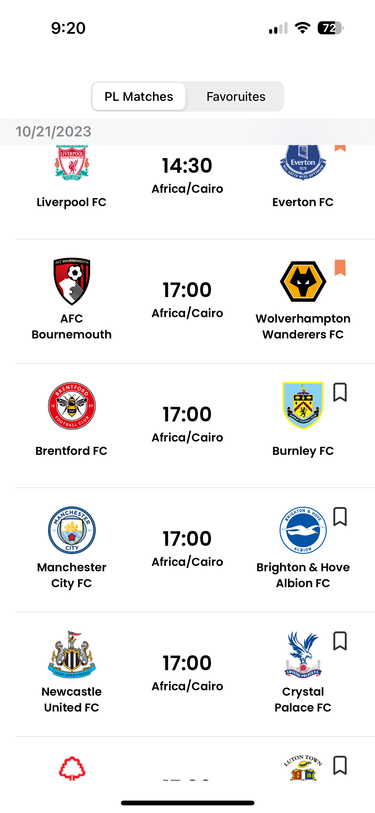

# Premier-League-Match-Grinta-iOS-Task
The goal is to create a sample app that displays information about the English Premier League.
# Premier League Match App

## Table of Contents
- [Introduction](#introduction)
- [Features](#features)
- [Requirements](#requirements)
- [Installation](#installation)
- [Usage](#usage)
- [How It Works](#how-it-works)
- [Contributing](#contributing)
- [License](#license)

## Introduction
The Premier League Match App is an iOS application built using Swift and UIKit. It provides users with real-time data about Premier League matches, including information about both played and unplayed matches, match scores, and match schedules. Users can also add matches to their favorites, and unplayed matches are automatically updated when the match results are available. The app leverages RxSwift for reactive programming and Realm for local data storage. It also includes unit tests to ensure code reliability.

## Features
- View and search for Premier League matches.
- See match details, including scores and match schedules.
- Add matches to your favorites.
- Automatically update unplayed matches with scores when available.
- Leveraging RxSwift for a responsive and reactive user experience.
- Data storage with Realm for offline access.
- Reactive Integration:** Seamlessly integrates with RxSwift for reactive updates to your table view.
- Effortless Data Binding:** Provides an elegant and efficient way to bind data to your table view.
- Smooth Animations:** Enables smooth animations when your data source changes, enhancing the user experience.
- Unit tests to ensure code quality.

## Requirements
- Xcode (12.0 or higher)
- Swift (5.0 or higher)
- iOS (13.0 or higher)
- CocoaPods (for RxSwift, RxDataSource, SDWebImage, optionallyDecodable and Realm, if applicable)

## Installation
1. Clone the repository.
2. Open the project in Xcode.
3. Build and run the app on your iOS device or simulator.

If you're using CocoaPods, run `pod install` in the project directory to install the required dependencies.

## Usage
1. Launch the app.
2. Browse through the list of Premier League matches.
3. Tap on a match to view its details, including the score or scheduled date.
4. To add a match to your favorites, tap the "Add to Favorites" button.
5. Unplayed matches will automatically update with scores when the results are available.

## How It Works
The app fetches data from a Premier League API to display information about matches. It uses RxSwift for a responsive and reactive UI, and Realm for storing match and favorite data locally. When you add an unplayed match to your favorites, the app monitors the API for score updates, and it will automatically update the match when the results are available.

## RxDataSource for Animation
The app also utilizes [RxDataSource](https://github.com/RxSwiftCommunity/RxDataSources) to bring animation to life in the table view. RxDataSource simplifies the setup and management of the table view, enabling smooth and intuitive animations when your data source changes. Whether you're viewing match scores or adding matches to your favorites, RxDataSource ensures a visually pleasing and interactive user interface.

## Contributing
We welcome contributions from the community. If you'd like to contribute to the project, please follow these steps:
1. Fork the repository.
2. Create a new branch for your feature or bug fix.
3. Make your changes.
4. Test your changes and ensure that the existing tests pass.
5. Create a pull request to submit your changes.

## License
This project is open-source and available under the [MIT License](LICENSE).
